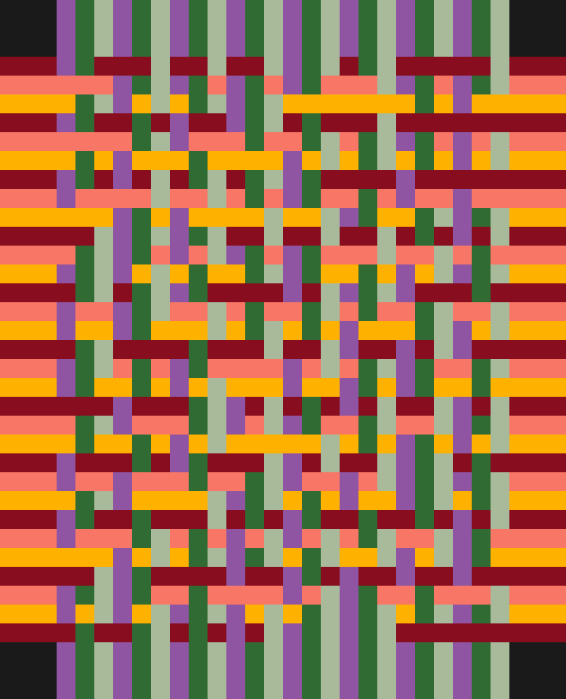
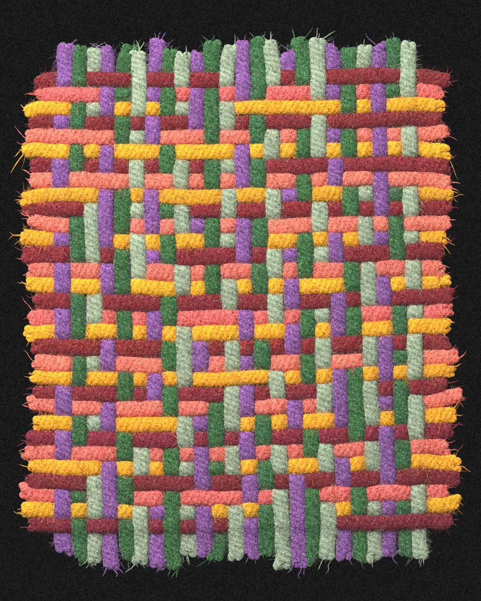

# Loom: generative woven cloth

Images of woven cloth from a JSON settings file. Two systems read the same
file:

- `plain.py` makes a **flat image**: one square per crossing, no rendering,
  instant. It ignores the render and post settings.
- `render.py` makes a **rendered image**: every thread as a 3D yarn rendered
  with Blender, then film grain and background (about a minute).

```
python plain.py run.json        # -> run.png
python render.py run.json       # -> run.jpg
python batch.py --n 100         # random runs of the favourites
```

Every image carries its full settings (seed included) inside the file, so
it can be redone exactly: `python render.py out/batch/001_....jpg`.

One settings file, the two systems:

| `plain.py` | `render.py` |
|---|---|
|  |  |

*`examples/second_order_94.json`: second-order rule 94, 24 threads across, in
`palette_0`, in a 4:5 frame.*

```
python plain.py examples/second_order_94.json -o examples/second_order_94_plain.png
python render.py examples/second_order_94.json -o examples/second_order_94_rendered.jpg
```

## Words

Cloth is woven from two sets of threads: the **warp** runs vertically, the
**weft** horizontally. At every crossing one of them is on top. The grid of
those choices is the **drawdown** (the weavers' term): an `h × w` array of
0 / 1, where **1 = warp on top** and 0 = weft on top, row 0 at the top.

## Generators: D(w, h, seed)

A pattern comes from a **generator**: a function `D(w, h, seed, **params)`
that returns a drawdown. The settings file names the generator and its
parameters:

```json
"pattern": {"generator": "second_order", "params": {"rule": 90}}
```

| generator | params | what it does |
|---|---|---|
| `plain_weave` | – | checkerboard, the simplest weave |
| `twill` | `over` (2), `under` (2) | diagonal ribs |
| `elementary` | `rule` 0-255, `burn_in` (50) | elementary 1D cellular automaton; each row is the next time step, from random start rows |
| `totalistic` | `rule` 0-63, `burn_in` (50) | radius-2 totalistic 1D CA (the "T" rules, e.g. T5 = rule 5) |
| `second_order` | `rule` 0-255, `burn_in` (50) | second-order, reversible 1D CA (the "R" rules, e.g. 90R = rule 90) |
| `total9` | `code` 0-1023, `start` ("cell"), `steps` (144) | 2D CA on the 3×3 block, grown from the centre (square growth) |
| `outer5` | `code` 0-1023, `start` ("cell"), `steps` (144) | 2D CA on the 4 side neighbours, grown from the centre (diamond growth) |

The seed sets the random start rows of the 1D automata, and the start patch
of the 2D ones when `start` is `"symmetric"` (random 4-fold symmetric 5×5
patch) or `"random"` (random 4×4 patch); `"cell"` is a single cell. For the
2D rules `steps` must let the growth cover the frame: about
`max(w, h) / 2` for `total9`, `(w + h) / 2` for `outer5`.

### Adding a generator

Write a function in any module of `loom/generators/`, decorate it with its
name, and make sure the module is imported at the bottom of
`loom/generators/__init__.py`:

```python
import numpy as np
from . import generator

@generator("stripes")
def stripes(w, h, seed, period=4):
    """Warp on top in every other band of `period` columns."""
    x = np.arange(w)
    return np.tile((x // period) % 2, (h, 1))
```

It must return an `h × w` array of 0 / 1 (checked when it runs) and should
draw any randomness from `seed`, so that a run can be reproduced.
`"pattern": {"generator": "stripes", "params": {"period": 6}}` then uses it.

## Settings file

A settings file only lists what differs from the defaults. Unknown keys are
an error (typos show up); keys starting with `_` are ignored and can hold
notes. Example:

```json
{
  "_note": "T5 in the cyan / violet palette, low density",
  "pattern": {"generator": "totalistic", "params": {"rule": 5}, "width": 24},
  "colors": "palette_2"
}
```

The files in `examples/` are written out in full instead: every key at its
default, as a reference of everything that can be set. Keys that are worked
out automatically (`pattern.height`, `render.style.margin`) stay `null`.

### Top level

| key | default | meaning |
|---|---|---|
| `seed` | random | one integer drives everything random: the pattern (start rows or patch) and the render details (thread irregularity, fraying, fibres, grain). Missing or `null`: a new one each run, stored in the image |
| `pattern` | see below | the drawdown |
| `colors` | `"original"` | `{"warp": [...], "weft": [...]}` hex colours, repeated across the columns (warp) and down the rows (weft); or the name of a palette in `palettes.json` |
| `plain` | see below | flat image only |
| `render` | see below | rendered image only |
| `post` | see below | rendered image only |

### pattern

| key | default | meaning |
|---|---|---|
| `generator` | `"second_order"` | generator name (table above) |
| `params` | `{"rule": 90}` | its parameters; given as a whole (changing the generator without `params` means none) |
| `width` | 48 | warp threads (columns); the density |
| `height` | automatic | weft threads (rows); automatic fills the render aspect ratio: a square lattice by default (48 → 48), or e.g. 48 → 62 at 4:5 |

### plain

| key | default | meaning |
|---|---|---|
| `scale` | 10 | pixels per crossing |
| `fringe` | 3 | crossings of loose thread on each side |
| `background` | `"#1a1a1a"` | colour around the cloth |

### render

| key | default | meaning |
|---|---|---|
| `size` | 1350 | longest image side, pixels |
| `aspect` | `"1:1"` | width : height; `"1:1"` is square, `"4:5"` is Instagram portrait (1080 × 1350) |
| `style` | see below | the look |

### render.style

Lengths are in thread spacings (distance between neighbouring threads).

**Threads**

| key | default | meaning |
|---|---|---|
| `gap` | -0.04 | space between neighbouring threads; negative: they overlap slightly (packed). 0.15: visible gaps |
| `half_height` | 0.17 | thread half-thickness (0.1: flat ribbon) |
| `amp` | 0.19 | how far a thread rises / sinks at a crossing |
| `wobble` | 0.04 | lateral waviness of each thread |
| `width_jitter` | 0.04 | per-thread width variation |
| `slub` | 0.03 | thickness variation along a thread |
| `distort` | `[[40, 0.3]]` | smooth displacement of the whole cloth: `[scale, amplitude]` layers |
| `drape` | `[]` | smooth height waves of the cloth, same format |

**Loose ends**

| key | default | meaning |
|---|---|---|
| `fringe` | 2.5 | length of the dangling ends |
| `fringe_jitter` | 0.2 | relative randomness of that length |
| `loose`, `wiggle` | 0.03, 0.05 | curl and kinks of the ends |
| `fray` | 0.5 | length of the unravelled tip (0: clean cut) |
| `fray_plies`, `fray_spread` | 3, 0.12 | plies of the tip, how far they splay |
| `fray_fibres` | 3 | stray fibres around each end |
| `taper` | 0 | 0..1 thinning of unfrayed ends |

**Yarn surface**

| key | default | meaning |
|---|---|---|
| `twist_angle` | 60 | angle of the ply stripes to the thread, degrees (90: rings, 0: lengthwise) |
| `twist_spacing` | 0.32 | distance between stripes |
| `twist_contrast`, `fibre_contrast` | 0.35, 0.8 | strength of the stripes and of the fibre streaks |
| `fibre_stretch` | 20 | how elongated the fibre streaks are |
| `bump`, `roughness`, `sheen` | 0.6, 0.8, 0.6 | relief, mattness, cloth sheen |
| `color_jitter` | 0.2 | per-thread brightness variation |
| `hue_jitter` | 0.013 | per-thread hue variation (1 = full circle) |

**Stray fibres**

| key | default | meaning |
|---|---|---|
| `fuzz` | 80 | stray fibres per thread spacing along every thread (0: none) |
| `fuzz_length` | 0.25 | typical fibre length |
| `fuzz_lift`, `fuzz_curl`, `fuzz_thickness` | 1.6, 2.5, 1 | how far they stand out, how curly, how thick |

**Other realism options** (tried and set aside): `ply_count` (0; 2-3 builds
threads from twisted plies, use with `samples_along` ~16), `subsurface` (0),
`specular` (0.5), `heather` (0), `saturation` (1).

**Light**

| key | default | meaning |
|---|---|---|
| `lighting` | `"area"` | key light: `"area"`, `"sun"`, `"spot"` or `"none"` |
| `light_tilt`, `light_azimuth` | 50, -150 | angle from vertical; direction (-150: from the top-left) |
| `light_strength` | 5.64 | brightness at the target |
| `light_distance`, `light_size` | 200, 160 | area / spot: distance, and size (spot: radius) |
| `light_softness` | 4 | sun only: angular size, degrees |
| `light_target` | `[0, 0]` | aim point, fraction of the half-image from the centre |
| `spot_angle`, `spot_blend` | 60, 0.8 | spot cone and edge softness |
| `light_color`, `fill_color` | white | `[r, g, b]`, 0..1 |
| `fill` | 0.4 | soft light from the opposite side |
| `hdri`, `hdri_strength`, `hdri_rotation` | `""`, 0.5, 0 | light from a Blender studio image (`"studio"`, `"interior"`, ...); the background stays black |

**Camera and quality**

| key | default | meaning |
|---|---|---|
| `view_transform`, `exposure` | `"Standard"`, 0 | tone mapping (`"AgX"`), exposure in stops |
| `samples`, `denoise` | 64, true | Cycles samples, denoiser |
| `margin` | automatic | border around the fringe; automatic keeps the same share of the image at any width |
| `samples_along`, `samples_around` | 8, 12 | mesh resolution of the threads |

### post

| key | default | meaning |
|---|---|---|
| `grain.amount` | 0.07 | film grain strength |
| `grain.size` | 1.5 | grain size, pixels |
| `grain.colour` | 0 | 0: monochrome, 1: per-channel colour grain |
| `grain.midtones` | 1 | 1: grain strongest in midtones, none in pure black |
| `background.level` | 26 | the black background lifted to this grey (0..255) |
| `background.tint` | `[1, 1, 1]` | colour of the lift (e.g. `[1, 0.92, 0.82]`: warm) |
| `background.grain`, `background.grain_size` | 0.025, 1.5 | grain on the background |

## Batch runs

`batch.py` draws random combinations of the patterns in `favourites.json`,
the widths (24, 36, 48) and the palettes in `palettes.json`, each with a new
seed, and swaps warp and weft colours half of the time. `--base run.json`
applies shared settings to every run, `--plain` makes flat previews instead
of renders. Results go to `out/batch/` (numbered images, `runs.jsonl`
with every image's settings, a contact sheet per 20 images); running it
again adds new combinations.

## Files

| path | what |
|---|---|
| `plain.py`, `render.py`, `batch.py` | the commands |
| `loom/generators/` | drawdown generators (`basic.py`, `ca1d.py`, `ca2d.py`) and their registry |
| `loom/settings.py` | defaults, reading and resolving settings |
| `loom/plain.py` | flat image |
| `loom/blender.py`, `loom/style.py` | Blender renderer and its settings |
| `loom/post.py` | film grain and background |
| `palettes.json` | named palettes: `original`, and `palette_0`-`palette_9` from the Coolors exports `palettes/palette_N.txt`, split into warp / weft (the exploration called them `p00`-`p09`) |
| `favourites.json` | the favourite patterns |
| `rendering.md`, `summary.md` | how the look was chosen; a short project summary |
